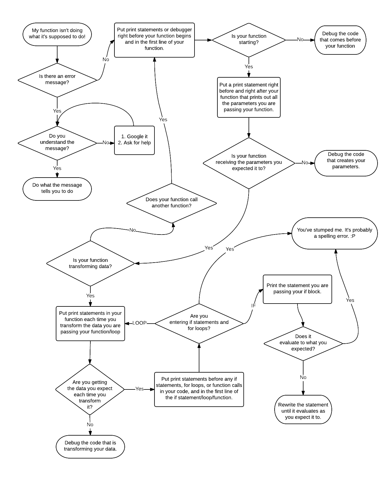

# Debugging
I'm just starting to learn javaScript and Ruby, an I thought that conceptualizing how I debug would be useful for me and hopefully for other people as well. Therefore...

##A flowchart for debugging your code

##Tools for debugging
Javascript
* console.log()
* use the console to set debugger pauses
* write `debugger;` in your code to pause in debugger

Rails
* byebug gem
* `render json: <your data>`

